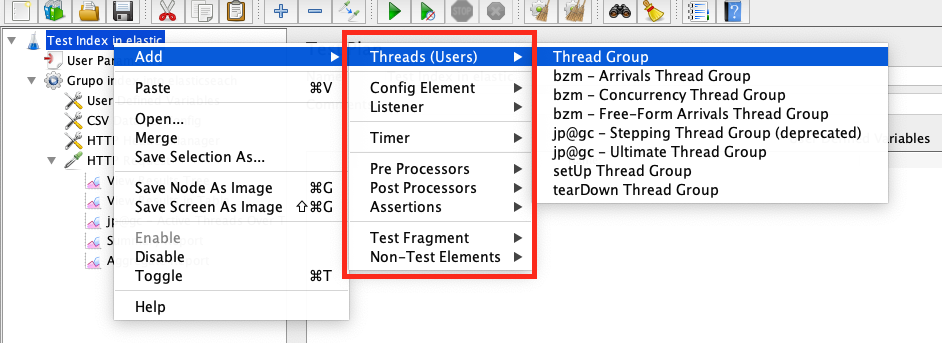

# Teste de performance

objetivo dos testes é determinar:
* Velocidade
* Escalabilidade 
* Estabilidade de um sistema

### Teste de carga
Carga que o sistema normalmente pode suportar


### Teste de stress
Sobrepassar os limites de carga que o sistema pode suportar


### Teste de resistencia

### Teste de escalabilidade

### Teste de Picos

# Ferramentas
* OctoPerf
* blazeMeter
* JMeter
* Gattling

# JMeter

* `Plan de teste:` objeto inicial
* `Thread(users):` elemento que define numero de threads de execução (numero de usuários).

Defina o número de threads
Defina o ramp-up (periodo de aceleração)
Defina loop (numero de veces para executar teste)

```
threads (users) = 100
ram-up (in seg) = 300
```
> retrasso  =  (ramp-up / thread) = (300/100)= 3 seg. de retrasso para cada requisição.


* `Config Element:` Elementos de configuração das requisições.
* `Timer:` temporizadores para controlar espaços relativos de tempo entre threads.
    Formula para cálculo de tempo aleatorio: numero ramdom num range[0-99] milisegundos.
    `| 0.X * <Random_Delay_maximum> + <Constant_Delay_Offset> |`
    `| 0.X * 100 + 0 |`
    Random Delay Maximum: 100
    Constant Delay Offset: 0
    A Onde: X pode ser [0-9]
    exemp:
        > 0.1 * 100 + 0 = 10ms

        > 0.8 * 100 + 0 = 80ms

* `Listener:` Receptores  elementos que permite ter acesso aos dados coletados dos testes, estatísticas, ate gráficos.


**`Teste de 1000 usuários concorrentes`**
quantidade: 1000 usuários
tempo : 1 segundo cada usuários
A capacidade de resolver 1000 request antes de dar timeout no garante que o sistema suporta 1000 usuários concorrentes.

longos períodos de tempo para obter erros de timeout.
exemplo: 
cargar servidor por longo período
para 1000 usuários concurrences:
* 600.000 request
* 600 segundos = 10 min
Ó:
* 6.000.000 request
* 6.000 segundos = 100 min

# Métricas
## Average
Media aritmética.

## Median
Mediana o valor central de uma lista de valores.

## deviation (desvio padrão):
Medida de dispersão em torno a média.

## Throughput
taxa de transferência em que os dados são transmitidos. Ele também pode ser definido como a quantidade de dados movidos com êxito de um lugar para outro em um determinado período.


# Bibliografía

* Certificação para teste de software [https://www.istqb.org/](https://www.istqb.org/)

* Ferramenta de performance de um site [https://gtmetrix.com/](https://gtmetrix.com/)

[🔝 Voltar ao Inicio](readme.md#%C#%ndice)