# Casos de Teste


## Indexação de dados em elastic
para teste de indexação precisamos indexar dados continuamente num período de tempo (x seg), com múltiplos usuários, e múltiplos dados de usuário, para isso tivemos que gerar dados  

### Criação de script em JMeter
O JMeter é uma ferramenta open source, desenvolvida para criar e executar testes de carga em serviços computacionais. Para a elaboração dos planos de teste, o JMeter pode te ajudar em:

* Configurar diversos tipos de requisições
* Criar loops e condições lógicas para cada requisição
* Importar dados para o plano através de arquivos csv (usuários, senhas)
* Configurar paralelismo através do número de threads, a quantidade de execução de cada thread e o intervalo entre cada uma
* Criar testes mais eficientes simulando múltiplos usuários e requisições independentes
* Simular um ataque ao seu servidor
* Apresentar o resultados do teste de várias formas (em árvore, tabela)

**`Plano de teste:`** É um container para execução de testes, definido o que e como vai ser testado, composto por vários elementos, para este caso adicionaremos:
> Plano de teste \> Add \> threads(Users) \> Thread Group

Definimos parâmetros dinamicamente para novos testes.

``` 
Threads:    ${thread}
ramp_up:    ${rampUp}
loop:       [X] infinite
```

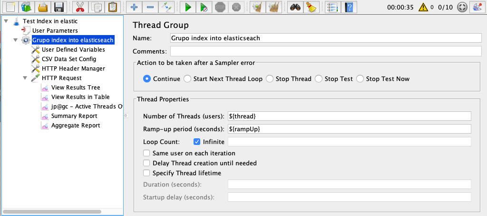

**`Adicionando elementos de configuração:`**

> Add \> Config element \> User Defined Variables

O primeiro elemento que iremos adicionar é `padrões de requisição HTTP` donde definimos os seguintes parâmetros reais para thread e rampUp,
e parâmetros dinâmicos para dados em csv e json.

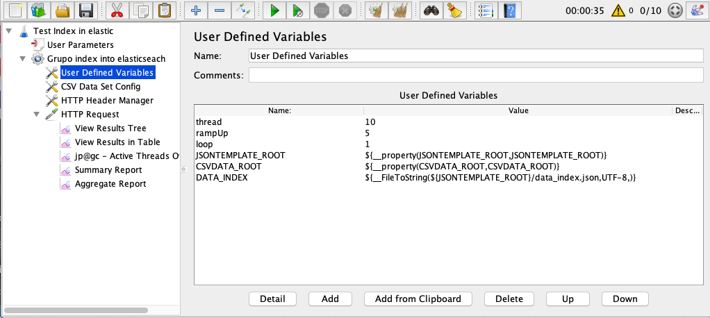

**`Configuração de Conjunto de Dados CSV (CSV Data Set Config)`**

Este elemento de configuração permite leitura de arquivos CSV e a atribuição desses dados em variáveis do JMeter que podem ser utilizadas durante o teste, a onde `${CSVDATA_ROOT}` é o path dinâmico, `1000_users_data.csv` arquivo csv com 1000 usuários gerados no [link 1](https://www.mockaroo.com/), [link 2](https://extendsclass.com/csv-generator.html), delimitados por nomes de variveis: *_id,user_name,numero_telefone,sexo,edade,online,var8,..._*

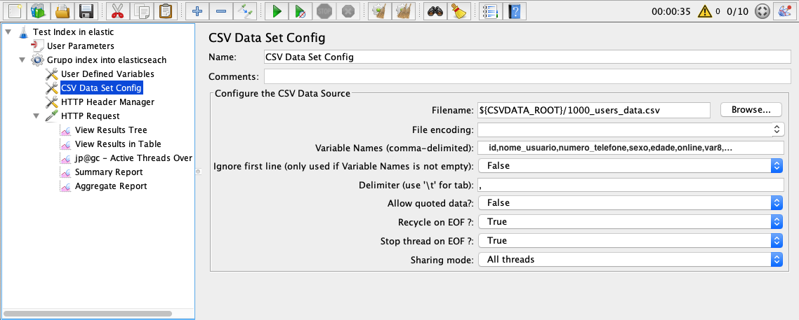

**`Adicionando elementos de cabeçalho:`**

> Add \> Config element \> Http Header Manager

pressionando  [add] adicionamos name:`Content-Type` e value: `application/json` que serão usados para as requisições.

**`Adicionando Requisição HTTP (HTTP Request):`**
A requisição HTTP é o elemento principal de um plano de teste, nele podemos definir os **verbo** que será utilizado (`POST`, `GET`, etc), e os seguintes atributos de configuração:
* `Name:` definimos um nome para nossa requisição. 
* `Server Name` parâmetro dinâmico
* `Port` parâmetro dinâmico
* `Method` definimos o verbo POST para indexar dados.
* `Path` caminho da rota com index dinâmico.
*`Parameters`* ${__eval(${DATA_INDEX})}, parâmetro das requisição em json.

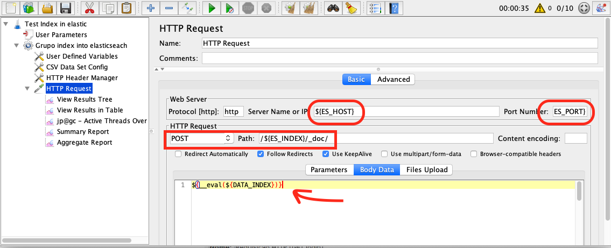

## Configurações gerais
*`configurar variáveis de ambiente:`*
a pasta de instalação do JMeter encontra-se:
> /usr/local/Cellar/jmeter/5.3_1/libexec/bin
> nano user.properties

Adicionamos os parâmetros globais de configuração, mudando nosso <index_name> e <path_real>.
```
ES_HOST=127.0.0.1
ES_PORT=9200
ES_INDEX=<index_name>
ES_TYPE=_doc
JSONTEMPLATE_ROOT=<path_real>/jsontemplates
CSVDATA_ROOT=<path_real>/testes
```
## Execução de teste e resultados
### Entendendo a tabela de Relatorio agregado
    Parâmetros de resultados:
    * Linha 90%, 95%, e 99%: (percentil 90, 95, 99) quer dizer que 90% das amostras não mais do que este tempo.

    Percentil é uma medida da estatística descritiva que tem o objetivo de dividir uma amostra de valores, ordenados de forma crescente, em cem partes. Frequentemente é usado para medir o grau de aceitação de algo.

> Verificar a resposta do sistema com 10 usuários.

```
período:    02:00 min
thread:     10 users
rum-up:     50 seg
```
Resultados:

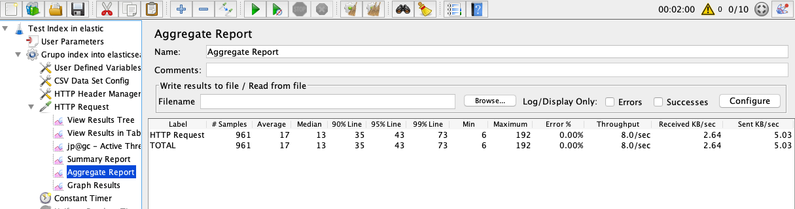

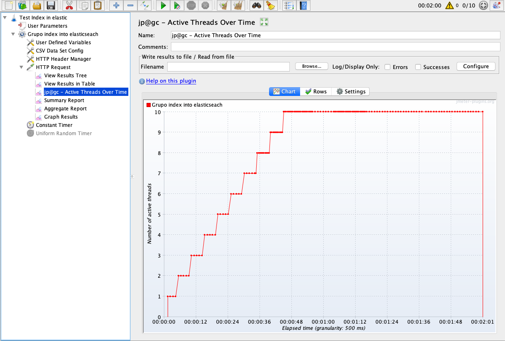

___  
> Verificar a resposta do sistema com 100 usuários.

```
período:    03:02 min
thread:     100 users
rum-up:     100 seg
```
Resultados: **12966** dados indexados, com taxa de erro **0.08%**
taxa de transferência **71.4/Sec**

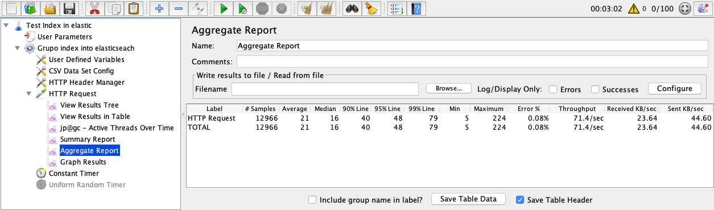

___
> Verificar a resposta do sistema com 400 usuários.
```
período:    04:00 min
thread:     400 users
rum-up:     100 seg
```
Resultados: **68042** requisições
taxa de erro: **0.13%**
taxa de transferencia: **287.7/sec.**

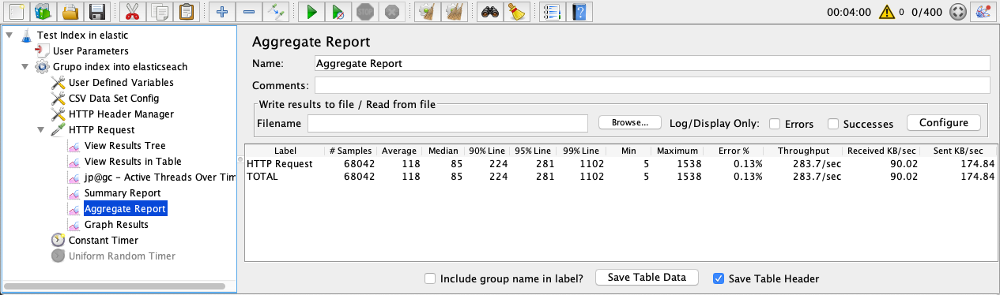


___
> Verificar a resposta do sistema com 500 usuários.
```
período:    04:00 min
thread:     500 users
rum-up:     100 seg
```
Resultados:  **80354** requisições
taxa de erro: **0.23%**
taxa de transferência: **335.3/sec**
percentil 90: 90% das requisições levaram 325/sec
percentil 95: 95% das requisições levaram 418/sec
percentil 99:

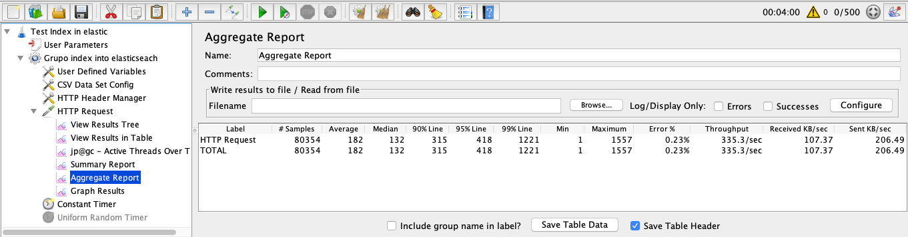

___
> Verificar a resposta do sistema com 700 usuários.

```
período:    04:00 min
thread:     700 users
rum-up:     100 seg
```
Resultados:  **85491** requisições
taxa de erro: **11.81%**
taxa de transferência: **335.3/sec**

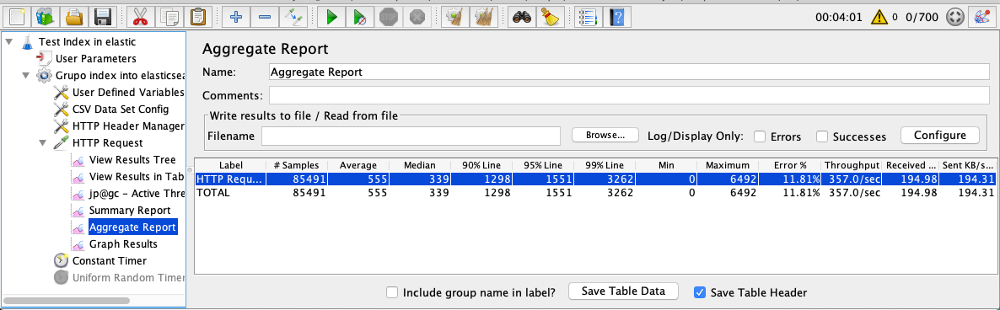

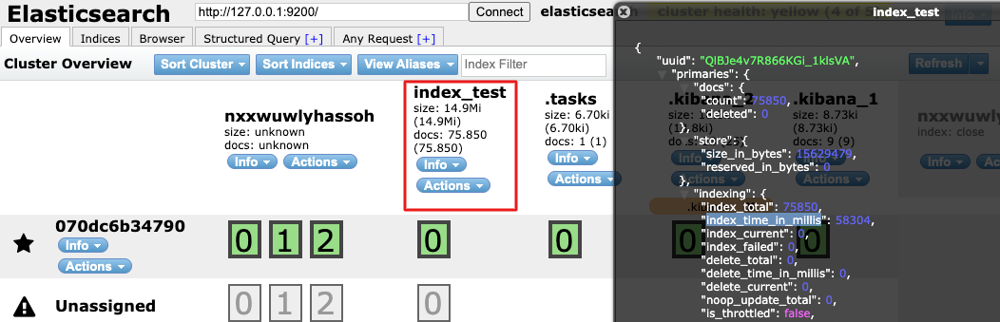

```
período:    06:19 min
thread:     700 users
rum-up:     300 seg
```

Resultados:  **111 835** requisições
taxa de erro: **1.37%**
taxa de transferência: **295.2/sec**

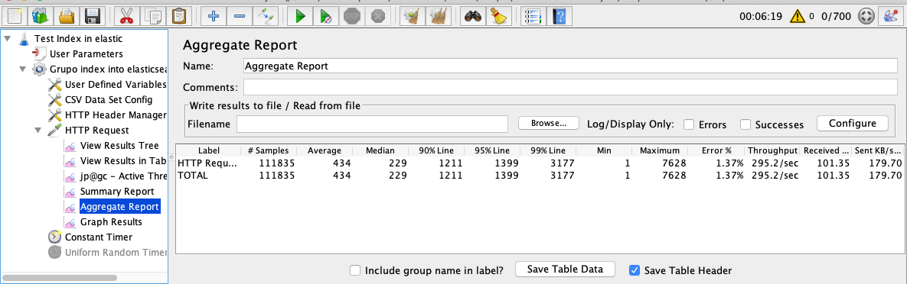

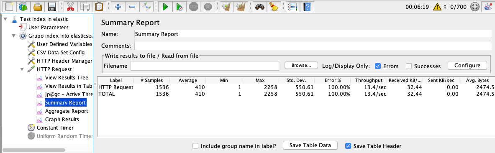

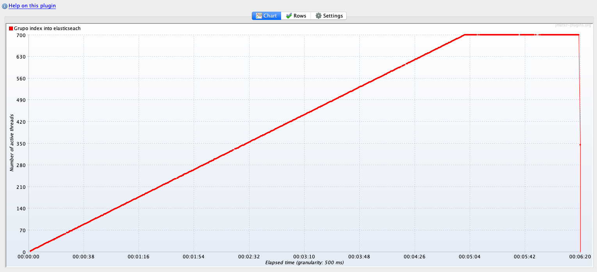

___
> verificar a resposta do sistema com 1000 usuários.

```
período:    07:01 min
thread:     1000 users
rum-up:     300 seg
```

Resultados:  **150 479** requisições
taxa de erro: **11.92%**
taxa de transferência: **3.58/sec**

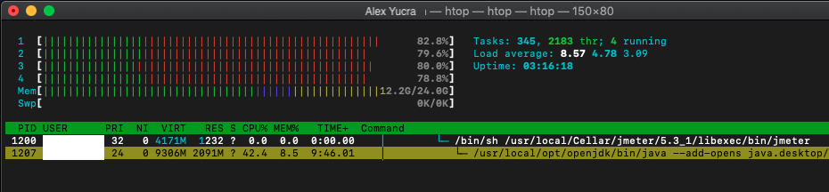

Reporte agregado


Reporte de erros

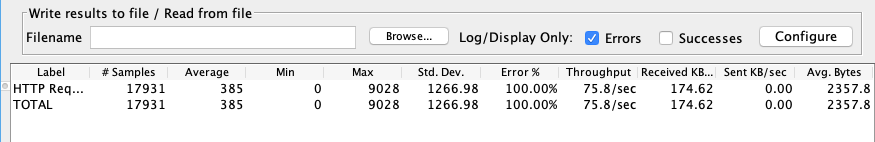

___
## Testes vários

> thread: 550 users | rum-up: 300 seg | 10:01 min
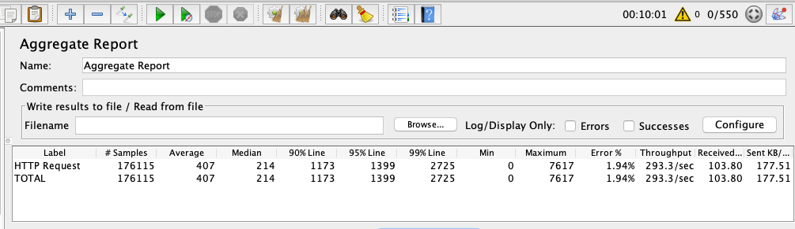

> thread: 500 users | rum-up: 300 seg | 10:00 min


___
## Buscas de dados em ElasticSearch

```
período:    08:13 min
thread:     1000 users
rum-up:     300 seg
```
```json
{
  "query": {
    "match": {
      "name": "${__eval(${username})}"
    }
  }
}
```

```json
{
    "query": {
      "bool": {
        "filter": [
          { "term": { "id_1": 18522 }},
          { "term": { "id_2": 4 }},
          { "term": { "name": "${__eval(${username})}" }}
        ]
      }
    }
}
```

```json
{
    "query": { 
      "bool": { 
        "must": [
          { "match": { "name":   "${__eval(${username})}"        }}
        ],
        "filter": [ 
          { "term":  { "gender": "${__eval(${gender})}" }}
        ]
      }
    }
  }
```

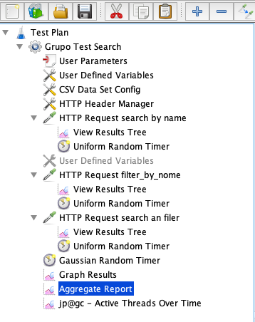

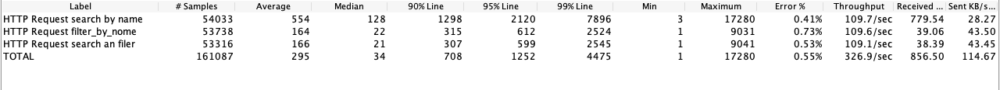

___
# Bibliografia
* instalar jmeter in mac [--> link](https://medium.com/@psychowhiz/install-jmeter-on-mac-25531bc2b2ad)

+ Exemplos de caso de uso [--> link](http://shipit.resultadosdigitais.com.br/blog/testes-de-carga-com-jmeter/)

* Analise de relatório do JMeter [--> link](https://stackoverflow.com/questions/20143401/how-to-analyze-a-jmeter-summary-report)


<!-- fin objetivo do artigo -->
[🔝 Voltar ao Inicio](readme.md#%C#%ndice)
___